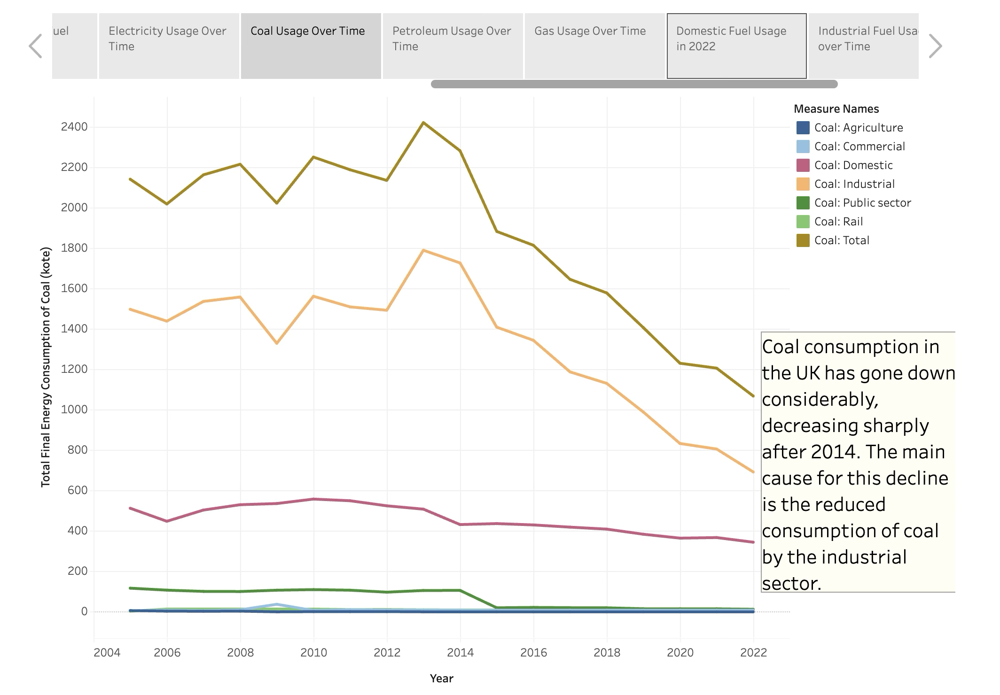

# Fuel-Usage-UK

Report on Fuel Usage In the United Kingdom from 2005 - 2022

Author:
Robert Davie

## Purpose:
To understand current trends in fuel usage and to key insights from data.

## Dataset:
Subnational total final consumption 2005 - 2022 dataset, available at https://www.gov.uk/government/collections/total-final-energy-consumption-at-sub-national-level. This dataset is an excel file.

## Data Preparation:
The data was prepared from the excel file using pandas in a Jupyter notebook. The excel book was separated into individual CSV files, with redundant columns being dropped. A year value was added to each CSV file to allow all of the CSV files to be combined together for ease of use. The output CSV is used directly for the Tableau workbook.

The data preparation can be viewed in the output_preparation.ipynb file.

## Visualisation:
The final report is available at https://public.tableau.com/app/profile/robert.davie7400/viz/Results_17365970791630/ReportonFuelUsageinUK2005-2022 

The report was made using Tableau, which features 11 slides of content giving an overview on topics such as coal usage over time by sector (see image below). A final slide gives the most significant insights gained overall.

(Example screenshot of one slide in the tableau workbook)

## Main insights:

* UK energy demands have decreased from the levels seen in 2005, which was likely accelerated by COVID.

* Bioenergy is the only fuel type which is seeing continued adoption from 2005 all the way to 2022.

* Petroleum, gas and electricity make up the majority of UK energy supplies. This is likely to continue into the future.

* Coal usage is falling over time, especially since 2014.

* Domestic demands are met mostly by gas and elecriticity.
